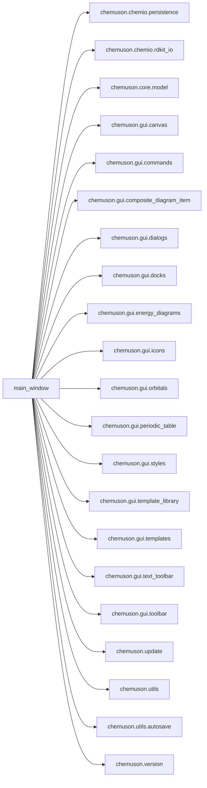
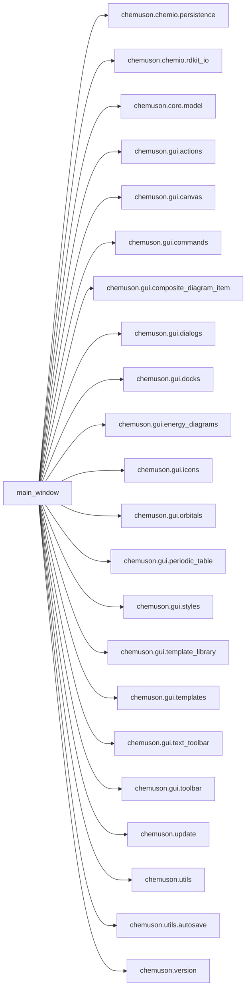

# Refactor arquitectónico incremental (abril 2026)

## 1) Mapa real de imports internos (actual)

- Total de aristas internas detectadas: **130**
- Top 10 hubs por dependencias salientes:
  - chemuson.gui.main_window: 22
  - chemuson.gui.canvas: 18
  - chemuson.update: 10
  - chemuson.gui.toolbar: 6
  - chemuson.update.core: 6
  - chemuson.gui.items: 5
  - chemuson.chemname.engine: 4
  - chemuson.gui.commands: 4
  - chemuson.gui.composite_diagram_item: 4
  - chemuson.gui.actions: 4

## 2) main_window como hub (antes/después)

### Antes

### Después

- Imports internos directos `main_window.py`: **21 → 22**.
- Cambio principal: externalización de construcción de acciones por dominio (`gui/actions/*`).

## 3) Archivos creados/movidos/eliminados

### Creados
- `src/chemuson/gui/actions/__init__.py`
- `src/chemuson/gui/actions/file_actions.py`
- `src/chemuson/gui/actions/edit_actions.py`
- `src/chemuson/gui/actions/project_actions.py`
- `src/chemuson/gui/actions/update_actions.py`

### Movidos
- Ninguno (refactor incremental sin renombrados masivos).

### Eliminados
- Ninguno en esta iteración.

## 4) Justificación breve por cambio

- Se separa la creación de acciones de GUI en módulos por dominio (`file`, `edit`, `project`, `update`) para reducir responsabilidades de `main_window.py`.
- `main_window.py` queda más orientado a coordinación y wiring general.
- Se mantiene compatibilidad funcional porque los `QAction` conservan nombres, atajos y señales.

## 5) Tests obsoletos eliminados y tests conservados

- Tests eliminados: ninguno en esta iteración (no se identificó evidencia suficiente de obsolescencia segura).
- Tests conservados y ejecutados para validar regresión de capas core/update:
  - `tests/test_core_model.py`
  - `tests/test_update_core.py`
