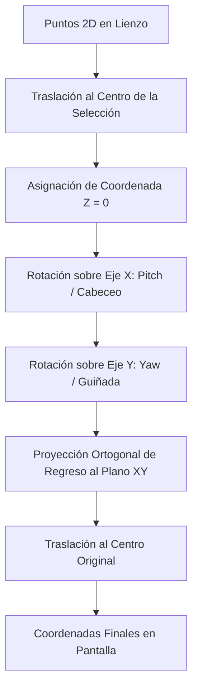

# Manual de Usuario de ChemUSON
*Editor Molecular 2D Avanzado con Capacidad de Perspectiva Pseudo-3D*

---

## 1. Introducción y Propósito

**ChemUSON** es un editor molecular 2D libre y de código abierto desarrollado por el **Grupo de Química Supramolecular de la Universidad de Sonora**. Su propósito principal es ofrecer una herramienta accesible, moderna y altamente especializada para el dibujo, análisis, visualización y exportación de estructuras químicas en entornos académicos, de investigación y de comunicación científica.

### Enfoque Científico y Educativo
A diferencia de los editores moleculares convencionales que se limitan a representaciones estrictamente bidimensionales de grafos químicos, ChemUSON introduce un enfoque híbrido pedagógico y de comunicación:
* **Visualización Dinámica:** Permite manipular la perspectiva tridimensional de las moléculas directamente desde el lienzo 2D sin necesidad de convertir el archivo a un formato 3D complejo, facilitando la comprensión de la estereoquímica, proyecciones y quiralidad.
* **Componentes de Diagramación Avanzada:** Integra herramientas nativas para dibujar perfiles energéticos (diagramas de energía de reacción), orbitales atómicos e híbridos parametrizables, y simuladores interactivos de técnicas experimentales como placas de Cromatografía en Capa Fina (TLC) y geles de Electroforesis.
* **Nomenclatura Química IUPAC-lite (ChemName):** Cuenta con un motor de traducción y generación de nomenclatura IUPAC en tiempo real que asiste a estudiantes y docentes en la asignación de nombres de hidrocarburos, heterociclos, anillos fusionados y complejos de coordinación simples.

---

## 2. Guía de Instalación y Requisitos

### Requisitos del Sistema
* **Sistema Operativo:** Linux (probado en distribuciones basadas en Arch, Ubuntu, Fedora) o Windows 10/11 (arquitectura x86_64).
* **Entorno de Ejecución:** Python 3.10 o superior.

### Dependencias Principales (Basadas en `pyproject.toml` y `requirements.txt`)
* **PyQt6:** Biblioteca de interfaz gráfica para la renderización del lienzo vectorial interactivo.
* **RDKit:** Kit de desarrollo químico imprescindible para cálculos de estereoquímica avanzada (percepción de quiralidad R/S, quiralidad axial, geometría E/Z), validación de valencias y round-trip de formatos químicos standard.
* **NumPy:** Utilizado en cálculos matriciales para transformaciones afines y rotaciones espaciales en el lienzo.
* **Pillow (PIL):** Soporte para renderizado y manipulación de anotaciones con imágenes.
* **Certifi:** Gestión segura de certificados SSL para el módulo de actualizaciones automáticas integradas.

### Instrucciones de Instalación para Desarrollo

1. **Clonar el repositorio y acceder a la carpeta del proyecto:**
   ```bash
   git clone https://github.com/pjgv333/Chemuson.git
   cd Chemuson
   ```

2. **Crear y activar un entorno virtual de Python:**
   ```bash
   python3 -m venv .venv
   source .venv/bin/activate
   ```

3. **Instalar las dependencias requeridas:**
   ```bash
   pip install --upgrade pip
   pip install -r requirements.txt
   ```

4. **Instalar el paquete en modo editable:**
   ```bash
   pip install -e .
   ```

5. **Ejecutar la aplicación:**
   ```bash
   chemuson
   ```

> [!TIP]
> **Instalación de RDKit:** Se recomienda instalar RDKit usando un gestor como `conda` o `micromamba` para evitar problemas con las dependencias binarias en plataformas Windows y Linux:
> ```bash
> micromamba create -n chemuson-rdkit -f packaging/conda/environment.yml
> micromamba activate chemuson-rdkit
> ```

---

## 3. Funcionalidades Clave

### A. Herramientas de Interfaz y Renderizado
La interfaz de ChemUSON está diseñada en torno a un lienzo vectorial interactivo basado en la arquitectura de escena y vista de Qt (`QGraphicsScene` / `QGraphicsView`).
* **Lienzo Inteligente:** Los átomos y enlaces no son meros dibujos, sino objetos lógicos interconectados en un grafo químico (`MolGraph`). Las etiquetas de los átomos se ajustan automáticamente según las valencias y el estado de la carga formal.
* **Paleta Orbital Vectorial:** Permite colocar e interconectar glifos de orbitales atómicos ($s$, $p$, $d$, $d_{z^2}$, $f$), híbridos ($sp$, $sp^2$, $sp^3$), y diagramas de enlaces moleculares ($\sigma$ y $\pi$ enlazantes). Los parámetros geométricos (ancho de lóbulos, nodos, gradientes de fase y dirección de luz) son completamente editables.
* **Simuladores de Laboratorio Integrados:**
  * **Cromatografía en Capa Fina (TLC):** Dibuja placas de TLC personalizables. Permite agregar carriles (`Lane`) y manchas (`Spot`), medir distancias, simular visualización por UV (254/365 nm) o reveladores químicos, y calcular automáticamente el factor de retención ($R_f$).
  * **Electroforesis en Gel:** Dibuja geles virtuales de electroforesis para simular corridas de ADN o proteínas, con control dinámico sobre la posición de carriles y bandas.
  * **Diagramas de Energía:** Generación intuitiva de diagramas de coordenadas de reacción para docencia, permitiendo trazar perfiles de energía libre de activación, estados de transición e intermedios estables de forma fluida.

---

### B. Herramienta de Rotación "Pseudo-3D" (Trackball)
Una de las innovaciones de ChemUSON es la manipulación de la perspectiva espacial 3D de estructuras bidimensionales a través de un modelo de proyección ortogonal interactivo.



#### Funcionamiento Técnico y Matemático:
Cuando el usuario inicia una rotación sobre un conjunto de átomos (o toda la estructura si no hay selección activa) mediante la combinación **Alt + Arrastre del Mouse**, el sistema ejecuta los siguientes pasos en la función `project_3d_rotation` en [geom.py](file:///mnt/HDD_4TB/chemuson/Chemuson/src/chemuson/gui/geom.py):
1. **Traslación:** Calcula el baricentro o centro geométrico $(C_x, C_y)$ de los átomos seleccionados y traslada todos los puntos al origen 3D $(0, 0, 0)$ asumiendo inicialmente que la profundidad de todos los átomos es $z_0 = 0.0$.
2. **Rotación Pitch (Eje X):** Se rota el plano vertical aplicando el ángulo $\theta_x$ (Pitch) obtenido a partir del desplazamiento vertical del cursor ($\Delta y$):
   $$y_{\text{new}} = y_0 \cos(\theta_x) - z_0 \sin(\theta_x)$$
   $$z_{\text{new}} = y_0 \sin(\theta_x) + z_0 \cos(\theta_x)$$
3. **Rotación Yaw (Eje Y):** Se rota el plano horizontal aplicando el ángulo $\theta_y$ (Yaw) derivado del desplazamiento horizontal del cursor ($\Delta x$):
   $$x_{\text{final}} = x_0 \cos(\theta_y) + z_{\text{new}} \sin(\theta_y)$$
   $$y_{\text{final}} = y_{\text{new}}$$
4. **Proyección y Retranslación:** Los puntos resultantes $(x_{\text{final}}, y_{\text{final}})$ se proyectan directamente sobre el lienzo y se re-trasladan sumando el centro $(C_x + x_{\text{final}}, C_y + y_{\text{final}})$.

#### Constantes y Restricciones de Control:
Para evitar la degradación o el "colapso plano" de las estructuras (donde la molécula pierde toda dimensionalidad y se aplana hasta convertirse en una línea), ChemUSON aplica restricciones estrictas definidas en [canvas_constants.py](file:///mnt/HDD_4TB/chemuson/Chemuson/src/chemuson/gui/canvas/canvas_constants.py):
* **Sensibilidad:** `TRACKBALL_ROTATION_DEG_PER_PIXEL = 1.0` (1 píxel de arrastre equivale a 1 grado de rotación).
* **Límite de Inclinación:** `TRACKBALL_MAX_TILT_DEG = 60.0`. Restringe el cabeceo y guiñada a un intervalo de $[-60^{\circ}, 60^{\circ}]$. Esto evita que los enlaces se solapen completamente y pierdan la coherencia geométrica en la proyección 2D.
* **Tolerancia de Coherencia:** `TRACKBALL_REFERENCE_MATCH_TOLERANCE_PX = 1.5`. Si la geometría molecular se modifica externamente (por ejemplo, al mover un átomo individual o aplicar una limpieza automática) en más de 1.5 píxeles, la matriz de referencia de la rotación 3D se reinicia para prevenir distorsiones acumuladas.

> [!IMPORTANT]
> **Rotación 3D Precisa:** La interfaz también cuenta con un modo numérico reproducible (`tool_rotate_3d_precise` / herramienta de Rotación Precisa) que invierte o rota la estructura mediante un diálogo interactivo (`TrackballRotationDialog`) donde se especifican los ángulos de Cabeceo (Pitch) y Guiñada (Yaw) exactos, con previsualización en tiempo real.

---

### C. Integración de la Geometría y Estilos de Enlaces Moleculares
ChemUSON ofrece una amplia biblioteca de estilos de enlaces (`BondStyle`) que definen cómo se dibuja visualmente la conectividad entre los átomos y cómo esto afecta a la química subyacente.

#### Tipos de Enlaces Soportados:
1. **Sencillo, Doble, Triple (Plain):** Líneas continuas estándar con espaciado óptico proporcional a la longitud de enlace por defecto.
2. **Bold:** Enlace de trazo grueso, ideal para destacar anillos frontales en proyecciones de Haworth.
3. **Cuña (Wedge):** Enlace en cuña sólida. Representa estereoquímica hacia adelante del plano del papel (`UP`).
4. **Hashed (Trazos):** Enlace en cuña discontinua. Representa estereoquímica hacia atrás del plano del papel (`DOWN`).
5. **Wavy (Ondulado):** Representa estereoquímica indeterminada o mezclas isoméricas (`EITHER`).
6. **Flex:** Enlaces curvos ajustables vectorialmente mediante puntos de control Bézier (`flex_curve_1` y `flex_curve_2`).
7. **Coordinativo (Coordination):** Representa enlaces dativos o de coordinación. Tienen un átomo donador específico. **Son estructurales pero químicamente neutros** (no modifican la valencia del metal o ligando, evitando errores falsos de valencia en complejos organometálicos).
8. **Interacción (Interaction):** Líneas punteadas para representar enlaces de hidrógeno o interacciones débiles. **No son estructurales ni aportan a la valencia**.

#### Algoritmo de Cálculo para Cuñas y Recortes (`trim`):
La visualización de cuñas sólidas y discontinuas calcula la silueta triangular mediante la función `compute_wedge_points` en [wedge_geometry.py](file:///mnt/HDD_4TB/chemuson/Chemuson/src/chemuson/gui/wedge_geometry.py):

* **Direccionalidad:** El enlace se expande desde la punta (vértice angosto en el átomo de origen $P_0$) hacia la base (ancho máximo en el átomo de destino $P_1$).
* **Evitación de Colisiones (Trim):** Para evitar que el extremo ancho de la cuña o la punta sólida invadan las etiquetas de texto de los elementos químicos (por ejemplo, al conectar con un Oxígeno `"O"` o Nitrógeno `"N"` explicitados), el algoritmo introduce recortes:
  $$\text{Punta modificada } (T_x, T_y) = P_0 + \vec{u} \cdot \text{trim\_start}$$
  $$\text{Base modificada } (B_x, B_y) = P_1 - \vec{u} \cdot \text{trim\_end}$$
  Donde $\vec{u}$ es el vector unitario director del enlace. Los recortes `trim_start` y `trim_end` se calculan dinámicamente según el tamaño de la caja de colisión del texto del átomo correspondiente.

---

## 4. Guía de Atajos de Teclado y Mouse

A continuación, se tabulan todas las combinaciones de teclas y acciones de mouse implementadas en el código fuente de ChemUSON para agilizar el dibujo y modelado molecular:

| Atajo / Combinación | Dispositivo | Contexto / Modo | Acción Realizada |
| :--- | :--- | :--- | :--- |
| **Alt + Arrastre Izq.** | Mouse | Selección | Inicia y actualiza la **Rotación Pseudo-3D (Trackball)** de los átomos seleccionados o la molécula completa sobre el centro visual. |
| **Alt + Clic Izq.** | Mouse | Selección | Clic sobre un átomo para alternar o establecer el anclaje de rotación (fijar pivote para el arrastre 3D). |
| **Alt + 0 (Cero)** | Teclado | Cualquier Modo | Restaura la perspectiva original plana (2D) de la molécula o selección activa, limpiando la rotación del Trackball. |
| **Ctrl + Alt + Rueda** | Mouse / Teclado | Enlace Doble | Invierte interactivamente el lado de la línea secundaria ($\pi$) del enlace doble seleccionado (orientación hacia adentro/afuera). |
| **Shift + Rueda** | Mouse | Cualquier Modo | Desplazamiento (Scroll) horizontal del lienzo. |
| **Rueda Arriba / Abajo**| Mouse | Cualquier Modo | Zoom incremental hacia adentro (Zoom In) o hacia afuera (Zoom Out) en el lienzo. |
| **Espacio (Mantener)** | Teclado | Cualquier Modo | Cambia el cursor a modo mano (`OpenHand`) y permite arrastrar el lienzo con el mouse para desplazarse (Panning). |
| **Teclas de Dirección** | Teclado | Selección Activa | Desplaza (Nudge) los átomos y anotaciones seleccionadas **1.0 px** en la dirección pulsada. |
| **Shift + Dirección** | Teclado | Selección Activa | Desplaza (Nudge) los átomos y anotaciones seleccionadas **10.0 px** en la dirección pulsada. |
| **Ctrl + K** | Teclado | Editor | Ejecuta la rutina de **Limpieza Geométrica 2D** (`Limpiar 2D`) del grafo químico activo. |
| **Ctrl + Alt + Left/Right**| Teclado | Selección de Enlace | Gira la rama acíclica un paso angular discreto hacia la izquierda o derecha usando snapping químico. |
| **Ctrl + Alt + I** | Teclado | Selección de Enlace | Invierte $180^{\circ}$ exactos la rama acíclica conectada al enlace seleccionado. |
| **Ctrl + Alt + A** | Teclado | Selección de Enlace | Autoacomoda la orientación de la rama acíclica para minimizar colisiones estéricas tridimensionales y solapamientos. |
| **Ctrl + D** | Teclado | Selección Activa | Duplica de manera exacta todos los elementos químicos y anotaciones seleccionados. |
| **Ctrl + A** / **Ctrl + E** | Teclado | Editor / Lienzo | Selecciona todos los átomos, enlaces y anotaciones visibles del documento. |
| **Ctrl + X** / **Ctrl + C** / **Ctrl + V** | Teclado | Editor | Corta, copia y pega los elementos del portapapeles químico de ChemUSON. |
| **Supr** / **Retroceso** | Teclado | Editor | Elimina la selección actual del lienzo o el elemento bajo el cursor si no hay selección. |
| **Esc (Escape)** | Teclado | Modos Especiales | Cancela el modo de inserción de plantillas químicas o de dibujo activo. |
| **Letra (a-z)** | Teclado | Selección de 1 Átomo | Abre inmediatamente la caja de edición rápida para ingresar o redefinir la etiqueta del elemento (ej. escribir `"NH2"`, `"COOH"`, `"O"`). |
| **1 al 9** | Teclado | Sobre Átomo Hover | Genera una cadena alifática (carbonos continuos) de longitud igual al número presionado. |
| **Shift + (3 al 9)** | Teclado | Sobre Átomo Hover | Genera e inserta un anillo cicloalcano fusionado del tamaño indicado (ej. `Shift+6` añade un ciclohexano). |
| **1 al 9** | Teclado | Sobre Enlace Hover | Cambia el orden del enlace de manera directa al dígito pulsado (ej. `1` = enlace simple, `2` = enlace doble, etc.). |
| **Shift + (3 al 9)** | Teclado | Sobre Enlace Hover | Genera y fusiona un anillo del tamaño indicado utilizando el enlace seleccionado como arista compartida. |
| **Ctrl + B** / **Ctrl + I** / **Ctrl + U** | Teclado | Edición de Texto | Formatea el texto de la anotación activa a Negrita, Cursiva o Subrayado respectivamente. |
| **Ctrl + =** | Teclado | Edición de Texto | Aplica formato de **Subíndice** al texto seleccionado. |
| **Ctrl + Shift + =** / **Ctrl + +** | Teclado | Edición de Texto | Aplica formato de **Superíndice** al texto seleccionado. |

---

## 5. Solución de Problemas Frecuentes (FAQ)

### P1: Un átomo en mi estructura se muestra subrayado y con letras rojas. ¿Qué significa y cómo lo soluciono?
* **Causa:** El subrayado rojo (código de color `#C0392B`) indica un **Error de Valencia (Valence Violation)**. El motor de ChemUSON realiza una validación isoelectrónica automática en tiempo real sumando los órdenes de enlace de los enlaces conectados, los hidrógenos implícitos calculados, los hidrógenos explícitos dibujados y el valor de la carga formal. Si la suma total no coincide con las valencias permitidas para el elemento en su estado iónico (ej. un Carbono neutro con 5 enlaces, u Oxígeno neutro con 3 enlaces), se activa esta advertencia visual.
* **Solución desde la interfaz:**
  1. Si dibujó un enlace extra por accidente, seleccione la herramienta **Borrador** (Erase) y elimine el enlace excedente.
  2. Si el átomo debe ser un ion (ej. un ion carboxilato $O^-$ o un ion amonio $N^+$), use la herramienta de **Carga** (`tool_charge_plus` o `tool_charge_minus`) y haga clic sobre el átomo para asignarle la carga correcta. Esto actualiza la lista de valencias isoelectrónicas válidas y removerá el error.
  3. Si desea dibujar una estructura de consulta incompleta (ej. para SMARTS) sin que el sistema asigne hidrógenos implícitos automáticos, haga clic derecho sobre el átomo y active la opción **Desactivar hidrógenos implícitos (No implicit hydrogens)**.

### P2: Al utilizar Alt + Arrastre, la molécula se aplanó por completo en una línea o se deformó y no puedo volver a su estado original.
* **Causa:** Dado que el lienzo parte de coordenadas 2D planas, si rota la molécula demasiado cerca de los límites críticos (cercanos a $90^{\circ}$ con respecto al plano del papel), la profundidad virtual $Z$ colapsa matemáticamente. Aunque la interfaz limita el giro máximo a $60^{\circ}$ (`TRACKBALL_MAX_TILT_DEG`), arrastres repetitivos o ediciones manuales sobre la perspectiva inclinada pueden desalinear la proyección.
* **Solución desde la interfaz:**
  1. Presione el atajo de teclado **Alt + 0 (Cero)** para restablecer inmediatamente la perspectiva. Esto cargará las posiciones de referencia originales previas a la rotación 3D.
  2. Si la molécula se ha deformado permanentemente por mover átomos mientras estaba en perspectiva 3D, seleccione la molécula completa y ejecute la herramienta **Limpiar 2D** (o use el atajo **Ctrl + K**). Esto recalculará una distribución geométrica regular optimizada en dos dimensiones.

### P3: Estoy dibujando un catalizador o complejo organometálico y los átomos metálicos del centro muestran errores de valencia constantemente.
* **Causa:** Los metales de transición (como el Paladio `Pd`, Platino `Pt`, Rutenio `Ru`) no tienen valencias covalentes típicas fijas en los diccionarios orgánicos estándar. Al conectar ligandos mediante enlaces convencionales (que restan valencia covalente a los átomos extremos), el software intentará calcular hidrógenos implícitos o arrojará violaciones de valencia en el metal o los ligandos coordinados.
* **Solución desde la interfaz:**
  1. Seleccione el átomo metálico central, haga clic derecho sobre él y actívelo como un **Centro de Coordinación (Coordination Center)**. Esto colocará visualmente una esfera de coordinación alrededor del metal y desactivará el cálculo automático de valencia orgánica sobre él.
  2. Reemplace los enlaces coordinativos covalentes por enlaces de estilo **Coordinación (Coordination)** desde la barra de herramientas de enlaces. Estos enlaces se dibujan con flechas y son **químicamente neutros**, lo que significa que el sistema no alterará el balance de hidrógenos de los ligandos (por ejemplo, el Nitrógeno de un ligando piridina coordinado no marcará error de valencia al formar el enlace dativo con el metal).

### P4: El nombre del compuesto mostrado en la barra de estado aparece como "N/D" en lugar del nombre químico real.
* **Causa:** El motor de nomenclatura integrado es del tipo **IUPAC-lite**. Esto significa que prioriza la estabilidad de la aplicación degradando el resultado de forma segura a `N/D` (No Disponible) en lugar de provocar una caída (crash) del software cuando se dibuja una estructura compleja no soportada (por ejemplo, anillos altamente fusionados no catalogados, estereoquímica exótica de múltiples centros o complejos de coordinación tridimensionales asimétricos).
* **Solución desde la interfaz:**
  1. Si su molécula contiene estereoquímica avanzada (quiralidad R/S, configuraciones cis/trans complejas), asegúrese de tener **RDKit** instalado y habilitado. Vaya al menú **Editar -> Preferencias -> RDKit** y asegúrese de que las opciones **Nombre avanzado** y **Usar RDKit aislado** estén activadas. Esto permitirá que la app delegue el análisis estereo al subproceso de RDKit.
  2. Simplifique las sustituciones exóticas o divida las estructuras en fragmentos si requiere validar la nomenclatura de partes individuales de un sistema orgánico sintético.
